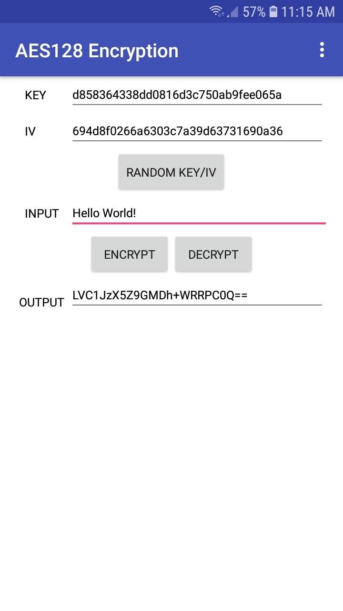
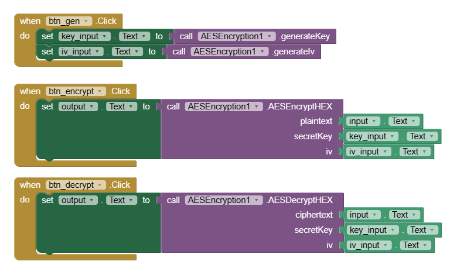

# MIT App Inventor AES128 Encryption Extension

This is a custom extension for MIT App Inventor, which enables AES128 CBC mode with PKCS5Padding in your mobile applications. AES (Advanced Encryption Standard) is a widely-used encryption algorithm that ensures secure data transmission and storage.

This extension is written in Java and can be compiled using the [Niotron IDE](https://ide.niotron.com/).

## Features

-   Encrypt and decrypt text using AES128 CBC mode with PKCS5Padding.
-   Key and IV can be generated using the `GenerateKey` and `GenerateIV` blocks.
-   Key and IV can be written in hexadecimal or utf-8 format.
-   Encryted text in base64 format.

## Getting Started

To use this extension in your MIT App Inventor projects, follow these simple steps:

1. Clone or download this repository to your local machine.
2. Open your MIT App Inventor project or create a new one.
3. In the MIT App Inventor design view, click on "Extensions" in the menu.
4. Select "Import Extension" and choose the downloaded extension file (build/AES128Extension.aix).
5. Once imported, the AES128 encryption blocks will be available in the "Blocks" section.

## How to Use

The extension provides blocks for both encryption and decryption using AES128. Here's a basic example of encrypting and decrypting a message:

## To Do

-   Add support for other key sizes (192 and 256 bits).
-   Improve error handling.

## License

This project is licensed under the [MIT License](LICENSE).
